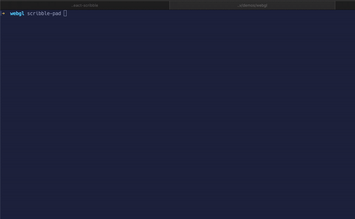

# Scribble Pad



This is an electron app and cli tool that allows you to spin up creative coding environments with just a file.

## Why

This is in early development but I would like a tool to not only be able to prototype creative coding projects, but also be able to distribute them as well. This will eventually have a tool to package the code as well in an electron app. As well as match the api an underlying tool [react-scribble](https://github.com/jcblw/react-scribble) to be able to add it into React applications as components.

## Technologies

- [Electron](https://www.electronjs.org/)
- [React](https://reactjs.org/)
- [Webpack](https://webpack.js.org/)

## Prior art

> Way more mature versions of this concept

- [Canvas-Sketch](https://github.com/mattdesl/canvas-sketch)

## Development

> Early development - there be :dragon:

First install all the dependencies via yarn.

```shell
yarn
```

Then you will need to build the CLI tool.

```shell
yarn build
```

Then you can just point it towards a file.

```shell
scribble-pad shaders.js
```
